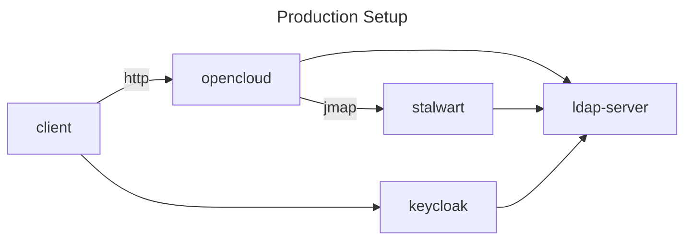
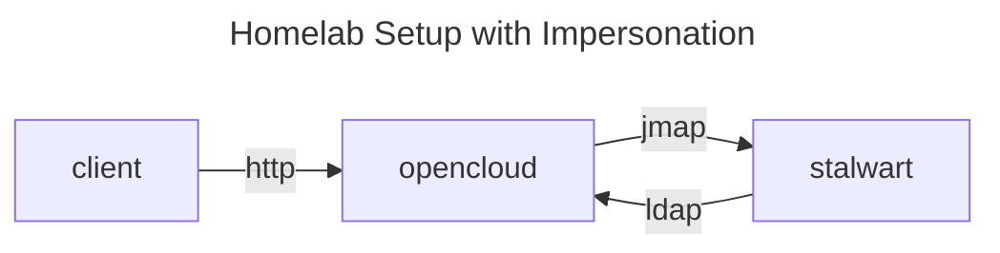
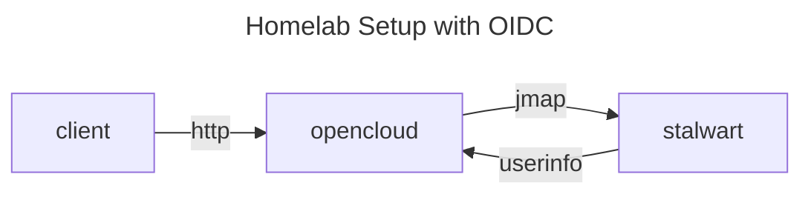

# Groupware Developer Guide

<!-- markdownlint-disable MD033 -->

## Introduction

The Groupware component of OpenCloud is implemented as a (micro)service within the OpenCloud framework (see `./services/groupware/`).

It is essentially providing a REST API to the OpenCloud UI clients (web, mobile) that is high-level and adapted to the needs of the UIs.

The implementation of that REST API turns those high-level APIs into lower-level [JMAP](https://jmap.io/) API calls to [Stalwart, the JMAP mail server](https://stalw.art/), using our own JMAP client library in `./pkg/jmap/` with a couple of additional RFCs used by JMAP in `./pkg/jscalendar` and `./pkg/jscontact`.

## Prerequisites

* `git`: (mandatory) to check out source code of OpenCloud and companion applications
* `openssl`: (optional) to test IMAPS with Stalwart, and optionally to create certificates
* `curl`: (recommended) to test the Groupware API, and to perform a few checks and tests
* `xh` or `httpie`: (optional) to test the Groupware API in a more convenient way
* `docker` (mandatory, including Docker Compose support)
* `go`: (mandatory) to build applications
* `node` + `pnpm`: (mandatory) to build the built-in IDM frontend

## Repository

The code lives in the same tree as the other OpenCloud backend services, albeit currently in the `groupware` branch, that gets rebased on `main` on a regular basis (at least once per week.)

Use [the `groupware` branch](https://github.com/opencloud-eu/opencloud/tree/groupware)

```bash
cd ~/src/opencloud/
OCDIR="$PWD"
git clone --branch groupware git@github.com:opencloud-eu/opencloud.git
```

Note that setting the variable `OCDIR` is merely going to help us with keeping the instructions below as generic as possible, it is not an environment variable that is used by OpenCloud, or required for OpenCloud to function in any way.

### Tools Repository

Also, you might want to check out these [helper scripts in opencloud-tools](https://github.com/pbleser-oc/opencloud-tools) somewhere and put that directory into your `PATH`, as it contains scripts to test and build the OpenCloud Groupware:

```bash
cd "$OCDIR/"
git clone git@github.com:pbleser-oc/opencloud-tools.git ./bin
echo "export PATH=\"\$PATH:$OCDIR/bin\"" >> ~/.bashrc
```

#### Tools Prerequisites

Those scripts have the following prerequisites:

* the [`jq`](https://github.com/jqlang/jq) JSON query command-line tool to extract access tokens,
* either the [httpie](https://httpie.io/cli) (`pipx install httpie`) or [`xh`](https://github.com/ducaale/xh) (`cargo install xh --locked`) command-line HTTP clients, just out of convenience as their output is much nicer than curl's
* `curl` as well, to retrieve the access tokens from Keycloak (no need for nice output there)

## Configuration

Since we require having a Stalwart container running at the very least, the preferred way of running OpenCloud and its adjacent services for developing the Groupware component is by using the `opencloud_full` Docker Compose setup in `$OCDIR/opencloud/devtools/deployments/opencloud_full/`.

This section will explain how to configure that Docker Compose setup for the needs of the Groupware backend.

### Hosts

The default hostname domain for the containers is `.opencloud.test`

Make sure to have the following entries in your `/etc/hosts`:

```ruby
127.0.0.1       cloud.opencloud.test
127.0.0.1       keycloak.opencloud.test
127.0.0.1       wopiserver.opencloud.test
127.0.0.1       mail.opencloud.test
127.0.0.1       collabora.opencloud.test
127.0.0.1       traefik.opencloud.test
127.0.0.1       stalwart.opencloud.test
```

Alternatively, use the following shell snippet to extract it in a more automated fashion:

```bash
cd "$OCDIR/opencloud/devtools/deployments/opencloud_full/"

perl -ne 'if (/^([A-Z][A-Z0-9]+)_DOMAIN=(.*)$/) { print length($2) < 1 ? lc($1).".opencloud.test" : $2,"\n"}' <.env\
|sort|while read n; do \
grep -w -q "$n" /etc/hosts && echo -e "\e[32;4mexists :\e[0m $n: \e[32m$(grep -w $n /etc/hosts)\e[0m">&2 ||\
{ echo -e "\e[33;4mmissing:\e[0m ${n}" >&2; echo -e "127.0.0.1\t${n}";};\
done \
| sudo tee -a /etc/hosts
```

### Compose

There are four options, either

1. running the Groupware backend with OpenLDAP and Keycloak containers, along with master authentication between the Groupware backend and Stalwart, more akin to a production setup;
2. running the Groupware backend with OpenLDAP and Keycloak containers, along with OIDC Bearer token authentication between the Groupware backend and Stalwart, even more akin to a production setup;
3. running the Groupware backend using the built-in LDAP and OIDC services, along with master authentication between the Groupware backend and Stalwart, for a minimalistic setup that uses less resources and is more likely to be found in a home lab setup;
4. running the Groupware backend using the built-in LDAP and OIDC services, along with OIDC Bearer token authentication between the Groupware backend and Stalwart.

> [!NOTE]
> Note that option 2 is currently not implemented yet.
>
> Furthermore, at this time of writing, options 1 and 4 are not properly documented yet due to changes in how Stalwart 0.16 and newer
> handle their configuration, for which instructions and configuration files still need to be updated.
>
> For the time being, use the ["built-in LDAP with master authentication"](#homelab-setup-master) option instead.

In either case, the Docker Compose configuration in `$OCDIR/opencloud/devtools/deployments/opencloud_full/` needs to be modified.

#### Production Setup with Master Authentication

<a name="prod-setup-master"></a>



##### Production Setup Instructions

> [!NOTE]
> The setup instructions are currently outdated, due to Stalwart 0.16 or higher having completely overhauled
> the way they are configured, and will be caught up with and updated in due time, when needed.
>
> For now, use the ["built-in LDAP with master authentication"](#homelab-setup-master) option instead.

Edit `$OCDIR/opencloud/devtools/deployments/opencloud_full/.env`, making the following changes (make sure to check out [the shell command-line that automates all of that, below](#automate-env-setup-prod-master)):

* change the container image to `opencloudeu/opencloud:dev`:

```diff
-OC_DOCKER_IMAGE=opencloudeu/opencloud-rolling
+OC_DOCKER_IMAGE=opencloudeu/opencloud
-OC_DOCKER_TAG=
+OC_DOCKER_TAG=dev
```

* add the `groupware` service to `START_ADDITIONAL_SERVICES`:

```diff
-START_ADDITIONAL_SERVICES="notifications"
+START_ADDITIONAL_SERVICES="notifications,groupware"
```

* enable the OpenLDAP container:

```diff
-#LDAP=:ldap.yml
+LDAP=:ldap.yml
```

* enable the Keycloak container:

```diff
-#KEYCLOAK=:keycloak.yml
+KEYCLOAK=:keycloak.yml
```

* enable the Stalwart container:

```diff
-#STALWART=:stalwart.yml
+STALWART=:stalwart.yml
```

* optionally disable the Collabora container

```diff
-COLLABORA=:collabora.yml
+#COLLABORA=:collabora.yml
```

* optionally disable UI containers

```diff
-UNZIP=:web_extensions/unzip.yml
-DRAWIO=:web_extensions/drawio.yml
-JSONVIEWER=:web_extensions/jsonviewer.yml
-PROGRESSBARS=:web_extensions/progressbars.yml
-EXTERNALSITES=:web_extensions/externalsites.yml
+#UNZIP=:web_extensions/unzip.yml
+#DRAWIO=:web_extensions/drawio.yml
+#JSONVIEWER=:web_extensions/jsonviewer.yml
+#PROGRESSBARS=:web_extensions/progressbars.yml
+#EXTERNALSITES=:web_extensions/externalsites.yml
```

##### Production Setup Script

<a name="automate-env-setup-prod-master"></a>
All those changes above can be automated with the following script:

```bash
cd "$OCDIR/opencloud/devtools/deployments/opencloud_full/"
perl -pi -e '
  s|^(OC_DOCKER_IMAGE)=.*$|$1=opencloudeu/opencloud|;
  s|^(OC_DOCKER_TAG)=.*$|$1=dev|;
  s|^(START_ADDITIONAL_SERVICES=".*(?<!groupware))"|$1,groupware"|;
  s,^#(LDAP|KEYCLOAK|STALWART)=(.+)$,$1=$2,;
' .env
```

To disable Web UI services in case you are only interested in the backend service(s):

```bash
cd "$OCDIR/opencloud/devtools/deployments/opencloud_full/"
perl -pi -e '
  s|^([A-Z]+=:web_extensions/.*yml)$|#$1|;
  s,^(COLLABORA)=(.+)$,#$1=$2,;
' .env
```

#### Homelab Setup with Master Authentication

<a name="homelab-setup"></a>
<a name="homelab-setup-master"></a>



"Master Authentication" actually refers to [impersonation](https://stalw.art/docs/auth/authorization/administrator/#impersonation), which works as follows:

* the JMAP username (that is being impersonated) is suffixed with the single character `%` and then the username of the "master account" (the one that impersonates)
* so for authenticating as `alan@example.org` using the impersonating/master account `admin@example.org`, the username must be `alan@example.org%admin@example.org`
* the password is obviously the one of the impersonating/master account (so the one of `admin@example.org` in our case)

Since the OpenCloud Groupware service does not have access to the clear text password of the user, typically because the authentication in a production environment will go through OIDC, where only the IdP (such as Keycloak) will see the clear text password, impersonation is required to authenticate between the OpenCloud Groupware service and Stalwart.

Alternatively, OIDC authentication can be used as well, which requires a different configuration setup in Stalwart.

In Stalwart, impersonation requires having a user that has the `impersonate` permission. When using the `opencloud_full` setup, the Stalwart configuration that is imported (using the `stalwart-import` container) adds that permission to the user `admin@example.org` which is one of the pre-provisionined users in the OpenCloud LDAP.

##### Homelab Setup Instructions

Edit `$OCDIR/opencloud/devtools/deployments/opencloud_full/.env`, making the following changes (make sure to check out [the shell command-line that automates all of that, below](#automate-env-setup-homelab-master)):

* change the container image to `opencloudeu/opencloud:dev`:

```diff
-OC_DOCKER_IMAGE=opencloudeu/opencloud-rolling
+OC_DOCKER_IMAGE=opencloudeu/opencloud
-OC_DOCKER_TAG=
+OC_DOCKER_TAG=dev
```

* enable the creation of demo users:

```diff
-DEMO_USERS=
+DEMO_USERS=true
```

* add the `groupware` service to `START_ADDITIONAL_SERVICES`:

```diff
-START_ADDITIONAL_SERVICES="notifications"
+START_ADDITIONAL_SERVICES="notifications,groupware"
```

* enable the Stalwart container:

```diff
-#STALWART=:stalwart.yml
+STALWART=:stalwart.yml
```

* while not required, it is recommended to enable basic authentication support which, while less secure, allows for easier tooling when developing and testing HTTP APIs, by adding `PROXY_ENABLE_BASIC_AUTH=true` somewhere before the last line of the `.env` file:

```diff
 # Domain of Stalwart
 # Defaults to "stalwart.opencloud.test"
 STALWART_DOMAIN=

+# Enable basic authentication to facilitate HTTP API testing
+# Do not do this in production.
+PROXY_ENABLE_BASIC_AUTH=true
+
 ## IMPORTANT ##
```

* optionally disable the Collabora container

```diff
-COLLABORA=:collabora.yml
+#COLLABORA=:collabora.yml
```

* optionally disable UI containers

```diff
-UNZIP=:web_extensions/unzip.yml
-DRAWIO=:web_extensions/drawio.yml
-JSONVIEWER=:web_extensions/jsonviewer.yml
-PROGRESSBARS=:web_extensions/progressbars.yml
-EXTERNALSITES=:web_extensions/externalsites.yml
+#UNZIP=:web_extensions/unzip.yml
+#DRAWIO=:web_extensions/drawio.yml
+#JSONVIEWER=:web_extensions/jsonviewer.yml
+#PROGRESSBARS=:web_extensions/progressbars.yml
+#EXTERNALSITES=:web_extensions/externalsites.yml
```

##### Homelab Setup Script

<a name="automate-env-setup-homelab-master"></a>
All those changes above can be automated with the following script:

```bash
cd "$OCDIR/opencloud/devtools/deployments/opencloud_full/"
perl -pi -e '
  BEGIN{$basic_auth=0}
  s|^(OC_DOCKER_IMAGE)=.*$|$1=opencloudeu/opencloud|;
  s|^(OC_DOCKER_TAG)=.*$|$1=dev|;
  s|^(START_ADDITIONAL_SERVICES=".*(?<!groupware))"|$1,groupware"|;
  s,^(DEMO_USERS)=.*,$1=true,;
  s,^#(STALWART)=(.+)$,$1=$2,;
  s,^#(PROXY_ENABLE_BASIC_AUTH)=(.*)$,$1=true,;
  $basic_auth=1 if /^PROXY_ENABLE_BASIC_AUTH=/;
  print "\n# Enable basic authentication to facilitate HTTP API testing\n# Do not do this in production.\nPROXY_ENABLE_BASIC_AUTH=true\n\n" if /^## IMPORTANT ##/ && !$basic_auth;
' .env
```

To disable Web UI services in case you are only interested in the backend service(s):

```bash
cd "$OCDIR/opencloud/devtools/deployments/opencloud_full/"
perl -pi -e '
  s|^([A-Z]+=:web_extensions/.*yml)$|#$1|;
  s,^(COLLABORA)=(.+)$,#$1=$2,;
' .env
```

##### Homelab Setup LDAP Certificates

<a name="homelab-certs"></a>

We also need to create a private key and a certificate in order to be able to expose LDAP over SSL in the built-in IDM in the `opencloud` container, which can be achieved as follows:

```bash
cd "$OCDIR/opencloud/devtools/deployments/opencloud_full/"
docker compose run --rm opencloud-certs
```

Alternatively, like this:

```bash
openssl req -subj '/CN=opencloud.test' -x509 -newkey rsa:4096 -sha256 -days 365 -batch -nodes \
  -keyout ./config/opencloud/certs/ldaps.key \
  -out ./config/opencloud/certs/ldaps.crt
chmod 666 ./config/opencloud/certs/ldaps.*
```

Note that this is only required once, as the certificate only expires after 10 years, and is stored under `./config/opencloud/certs/`.

#### Homelab Setup with OIDC Authentication

<a name="homelab-setup-oidc"></a>



> [!NOTE]
> The setup instructions are currently outdated, due to Stalwart 0.16 or higher having completely overhauled
> the way they are configured, and will be caught up with and updated in due time, when needed.
>
> For now, use the ["built-in LDAP with master authentication"](#homelab-setup-master) option instead.

With this setup, the authentication flow is as follows:

1. the client authenticates against an Identity Provider (IdP) to obtain a JWT, typically by submitting username and password credentials
1. the client uses this JWT to authenticate against OpenCloud
1. OpenCloud swaps that IdP issued JWT against an internal one, that it mints on its own
1. the OpenCloud Groupware service uses that internal JWT in JMAP requests that it sends to Stalwart, using bearer authentication
1. Stalwart is configured to verify that internal token by submitting it to a Token Introspection Endpoint which is running as an OpenCloud service, namely `auth-api`, which also needs to be enabled explicitly in the configuration

##### Homelab Setup with OIDC Setup Instructions

Edit `$OCDIR/opencloud/devtools/deployments/opencloud_full/.env`, making the following changes (make sure to check out [the shell command-line that automates all of that, below](#automate-env-setup-homelab-oidc)):

* change the container image to `opencloudeu/opencloud:dev`:

```diff
-OC_DOCKER_IMAGE=opencloudeu/opencloud-rolling
+OC_DOCKER_IMAGE=opencloudeu/opencloud
-OC_DOCKER_TAG=
+OC_DOCKER_TAG=dev
```

* enable the creation of demo users:

```diff
-DEMO_USERS=
+DEMO_USERS=true
```

* add the `groupware` and the `auth-api` services to `START_ADDITIONAL_SERVICES`:

```diff
-START_ADDITIONAL_SERVICES="notifications"
+START_ADDITIONAL_SERVICES="notifications,groupware,auth-api"
```

* enable the Stalwart container:

```diff
-#STALWART=:stalwart.yml
+STALWART=:stalwart.yml
```

* change the authentication directory configuration for Stalwart to `idmoidc` in the `.env` file, using the variable `STALWART_AUTH_DIRECTORY`:

```diff
 # Domain of Stalwart
 # Defaults to "stalwart.opencloud.test"
 STALWART_DOMAIN=
 # LDAP configuration to use for Stalwart:
 # Can either be either
 # - idmldap: for the built-in IDP/IDM, using Master Authentication between Groupware and Stalwart, and LDAP in Stalwart
 # - idmoidc: built-in IDP/IDM, using OIDC Userinfo between Groupware and Stalwart
 # - ldap: when using KeyCloak and OpenLDAP, with Master Authentication between Groupware and Stalwart, and LDAP in Stalwart
-STALWART_AUTH_DIRECTORY=idmldap
+STALWART_AUTH_DIRECTORY=idmoidc
```

* while not required, it is recommended to enable basic authentication support which, while less secure, allows for easier tooling when developing and testing HTTP APIs, by adding `PROXY_ENABLE_BASIC_AUTH=true` somewhere before the last line of the `.env` file:

```diff
+# Enable basic authentication to facilitate HTTP API testing
+# Do not do this in production.
+PROXY_ENABLE_BASIC_AUTH=true
+
 ## IMPORTANT ##
```

* optionally disable the Collabora container

```diff
-COLLABORA=:collabora.yml
+#COLLABORA=:collabora.yml
```

* optionally disable UI containers

```diff
-UNZIP=:web_extensions/unzip.yml
-DRAWIO=:web_extensions/drawio.yml
-JSONVIEWER=:web_extensions/jsonviewer.yml
-PROGRESSBARS=:web_extensions/progressbars.yml
-EXTERNALSITES=:web_extensions/externalsites.yml
+#UNZIP=:web_extensions/unzip.yml
+#DRAWIO=:web_extensions/drawio.yml
+#JSONVIEWER=:web_extensions/jsonviewer.yml
+#PROGRESSBARS=:web_extensions/progressbars.yml
+#EXTERNALSITES=:web_extensions/externalsites.yml
```

##### Homelab Setup with OIDC Setup Script

<a name="automate-env-setup-homelab-oidc"></a>
All those changes above can be automated with the following script:

```bash
cd "$OCDIR/opencloud/devtools/deployments/opencloud_full/"
perl -pi -e '
  BEGIN{$basic_auth=0}
  s|^(OC_DOCKER_IMAGE)=.*$|$1=opencloudeu/opencloud|;
  s|^(OC_DOCKER_TAG)=.*$|$1=dev|;
  s|^(START_ADDITIONAL_SERVICES=".*(?<!groupware))"|$1,groupware"|;
  s|^(START_ADDITIONAL_SERVICES=".*(?<!auth-api))"|$1,auth-api"|;
  s,^(DEMO_USERS)=.*,$1=true,;
  s,^#(STALWART)=(.+)$,$1=$2,;
  s,^(STALWART_AUTH_DIRECTORY)=.+$,$1=idmoidc,;
  s,^#(PROXY_ENABLE_BASIC_AUTH)=(.*)$,$1=true,;
  $basic_auth=1 if /^PROXY_ENABLE_BASIC_AUTH=/;
  print "\n# Enable basic authentication to facilitate HTTP API testing\n# Do not do this in production.\nPROXY_ENABLE_BASIC_AUTH=true\n\n" if /^## IMPORTANT ##/ && !$basic_auth;
' .env
```

To disable Web UI services in case you are only interested in the backend service(s):

```bash
cd "$OCDIR/opencloud/devtools/deployments/opencloud_full/"
perl -pi -e '
  s|^([A-Z]+=:web_extensions/.*yml)$|#$1|;
  s,^(COLLABORA)=(.+)$,#$1=$2,;
' .env
```

> [!NOTE]
> Unfortunately, as of now, the hostname or IP address of the host that runs the Groupware backend (or the OpenCloud single binary) needs to be configured manually
> in `devtools/deployments/opencloud_full/config/stalwart/idmoidc.toml`, specifically in the variable `directory.oidc.endpoint.url` since it highly depends on whether
> you are running it on the host (typically from an IDE)
> or as another container in the Docker Compose project.
> In the former case, it also depends on the operating system.
> It is currently hard-wired to be `http://172.17.0.1:10000/auth/...`, which only works
>
> * on Linux, where `172.17.0.1` _tends_ to be the gateway host IP address, for running the OpenCloud Groupware backend on the host
> * when the environment variable `AUTHAPI_HTTP_ADDR` is set to `0.0.0.0:10000`, allowing for HTTP access to the auth-api backend, instead of limiting it to HTTPS through the proxy, which opens a whole can of worms with making Stalwart accept self-signed certificates

## Building

Build the `opencloudeu/opencloud:dev` image first:

```bash
cd "$OCDIR/opencloud/"
make -C ./services/idp/ generate
make -C ./opencloud/ clean build dev-docker
```

## Running

And then run everything from the Docker Compose `opencloud_full` setup:

```bash
cd "$OCDIR/opencloud/devtools/deployments/opencloud_full/"
docker compose up -d
```

Stalwart >= 0.16 requires its configuration to be loaded into its data storage, which means that we also need to run an import of that configuration once.

It initially starts up in "recovery mode", and waits for a lockfile `.initialize` to exist on its storage volume (`opencloud_full_stalwart-data`).

To import the initial configuration and create that lockfile, run this from the same directory:

```bash
docker compose run --rm stalwart-import
```

The `stalwart` container will detect the existence of the lockfile that is created after successfully importing the configuration, and will then restart its process in regular mode.

This is only required the first time, or whenever one deleted the storage volume `opencloud_full_stalwart-data`.

### Running in an IDE in Production Setup

If you plan to make changes to the backend code base, it might be more convenient to do so from within VSCode, in which case you should run all the services from the Docker Compose setup as above, but stop the `opencloud` service container (as that one will be running from within your IDE instead):

```bash
cd "$OCDIR/opencloud/devtools/deployments/opencloud_full/"
docker compose stop opencloud
```

and then use the Launcher named "`OpenCloud server with external services`" in VSCode.

Do not do this if you plan to use the built-in IDM for OIDC and/or LDAP though, as that requires having an `opencloud` container running that is reachable from Stalwart, which would not be the case if it was solely running in an IDE on the host.

### Running in an IDE in Homelab Setup

Or if you want to do so but using the [&ldquo;homelab&rdquo; setup](#homelab-setup), then the `opencloud` container needs to be kept running, as it also provides LDAP and OIDC services, as the `stalwart` container cannot access those services on the `opencloud` process that is running on the host (in the IDE.)

In VSCode, use the Launcher `OpenCloud server with Groupware` instead, and keep the `opencloud` container running in the `opencloud_full` compose project.

It needs the following environment variables to be set:

* `OC_INSECURE`: `true`
* `PROXY_ENABLE_BASIC_AUTH`: `true`
* `IDM_CREATE_DEMO_USERS`: `true`
* `OC_ADMIN_USER_ID`: `some-admin-user-id-0000-000000000000`
* `IDM_ADMIN_PASSWORD`: `admin`
* `OC_SYSTEM_USER_ID`: `some-system-user-id-000-000000000000`
* `OC_SYSTEM_USER_API_KEY`: `some-system-user-machine-auth-api-key`
* `OC_JWT_SECRET`: `some-opencloud-jwt-secret`
* `OC_MACHINE_AUTH_API_KEY`: `some-opencloud-machine-auth-api-key`
* `OC_TRANSFER_SECRET`: `some-opencloud-transfer-secret`
* `COLLABORATION_WOPIAPP_SECRET`: `some-wopi-secret`
* `IDM_SVC_PASSWORD`: `some-ldap-idm-password`
* `GRAPH_LDAP_BIND_PASSWORD`: `some-ldap-idm-password`
* `IDM_REVASVC_PASSWORD`: `some-ldap-reva-password`
* `GROUPS_LDAP_BIND_PASSWORD`: `some-ldap-reva-password`
* `USERS_LDAP_BIND_PASSWORD`: `some-ldap-reva-password`
* `AUTH_BASIC_LDAP_BIND_PASSWORD`: `some-ldap-reva-password`
* `IDM_IDPSVC_PASSWORD`: `some-ldap-idp-password`
* `IDP_LDAP_BIND_PASSWORD`: `some-ldap-idp-password`
* `GATEWAY_STORAGE_USERS_MOUNT_ID`: `storage-users-1`
* `STORAGE_USERS_MOUNT_ID`: `storage-users-1`
* `GRAPH_APPLICATION_ID`: `application-1`
* `OC_SERVICE_ACCOUNT_ID`: `service-account-id`
* `OC_SERVICE_ACCOUNT_SECRET`: `service-account-secret`
* `OC_ADD_RUN_SERVICES`: `auth-api,groupware`
* `GROUPWARE_LOG_LEVEL`: `trace`
* `GROUPWARE_JMAP_MASTER_USERNAME`: `admin@example.org`
* `GROUPWARE_JMAP_MASTER_PASSWORD`: `admin`
* `GROUPWARE_SEND_DURATIONS_RESPONSE`: `true`
* `AUTHAPI_HTTP_ADDR`: `0.0.0.0:10000`
* `AUTHAPI_AUTH_REQUIRE_SHARED_SECRET`: `true`
* `AUTHAPI_AUTH_SHARED_SECRETS`: `stalwart=maethaR9eiXaiph8ahn8ohH6dahPiequ`

## Checking Services

To check whether the various services are running correctly:

### LDAP

#### Production Setup LDAP

When using the &ldquo;production&rdquo; setup (as depicted in section [Production Setup](#prod-setup-master) above), queries can be performed directly against the \
OpenLDAP container (`opencloud_full-openldap-1`) since its LDAP ports are mapped onto the host (to `:389` and `:636` for LDAP and LDAPS, respectively).

When using the OpenLDAP container, the necessary LDAP parameters are as follows:

* <u>Bind DN:</u> `cn=admin,dc=opencloud,dc=eu`
* <u>Bind Password:</u> `admin`
* <u>Base DN:</u> `ou=users,dc=opencloud,dc=eu`
* <u>Host:</u> `localhost`
* <u>LDAP Port:</u> `389`
* <u>LDAPS Port:</u> `636`

Run the following command on your host (requires the `ldap-tools` package with the `ldapsearch` CLI tool), which should output a list of DNs of demo users:

```bash
ldapsearch -H ldap://localhost -D 'cn=admin,dc=opencloud,dc=eu' \
-x -w 'admin' -b 'ou=users,dc=opencloud,dc=eu' -LLL \
'(objectClass=person)' dn
```

Sample output:

```ldif
dn: uid=alan,ou=users,dc=opencloud,dc=eu

dn: uid=lynn,ou=users,dc=opencloud,dc=eu

dn: uid=mary,ou=users,dc=opencloud,dc=eu

dn: uid=admin,ou=users,dc=opencloud,dc=eu

dn: uid=dennis,ou=users,dc=opencloud,dc=eu

dn: uid=margaret,ou=users,dc=opencloud,dc=eu

```

#### Homelab Setup LDAP

Instead, when using the &ldquo;homelab&rdquo; setup (as depicted in section [Homelab Setup](#homelab-setup) above), queries cannot be performed directly from the host but, instead, require spinning up another container in the same Docker network and do so from there.

The necessary LDAP parameters are as follows:

* <u>Bind DN:</u> `uid=libregraph,ou=sysusers,o=libregraph-idm`
* <u>Bind Password:</u> `admin` (or whichever password is set in the `IDM_REVASVC_PASSWORD` environment variable in `opencloud.yml`)
* <u>Base DN:</u> `o=libregraph-idm`
* <u>Host:</u> `localhost`
* <u>LDAP Port:</u> none, only supports LDAPS
* <u>LDAPS Port:</u> `9235`

To access the LDAP tree, spawn a new container in the same network, e.g. like this for a Debian 12 container:

```bash
docker run --network 'opencloud_full_opencloud-net' --rm \
--name "debian-${RANDOM}" -ti 'debian:12'
```

In that container, install the necessary packages to have the LDAP command-line tools:

```bash
apt-get update -y && apt-get install -y ca-certificates ldap-utils
```

Alternatively, the same can be achieved with an Alpine container:

```bash
docker run --network 'opencloud_full_opencloud-net' --rm \
--name "alpine-${RANDOM}" -ti 'alpine'
```

And running this command instead to install the LDAP command-line tools:

```bash
apk update && apk install openldap-clients
```

Run the following command in that container, which should output a list of DNs of demo users:

```bash
LDAPTLS_REQCERT=never ldapsearch -H ldaps://opencloud:9235 \
-D 'uid=reva,ou=sysusers,o=libregraph-idm' -x -w 'admin' \
-b 'o=libregraph-idm' -LLL \
'(objectClass=person)' dn
```

> [!NOTE]
> The `LDAPTLS_REQCERT` environment variable is set to `never` to prevent the `ldapsearch` application to validate the TLS certificate of the LDAP server, since we are using self-signed certificates for all those services in the devtools setups.

Sample output:

```ldif
dn: uid=admin,ou=users,o=libregraph-idm

dn: uid=alan,ou=users,o=libregraph-idm

dn: uid=lynn,ou=users,o=libregraph-idm

dn: uid=mary,ou=users,o=libregraph-idm

dn: uid=margaret,ou=users,o=libregraph-idm

dn: uid=dennis,ou=users,o=libregraph-idm

```

Alternatively, as a one-liner using an Alpine Docker image:

```bash
docker run --network 'opencloud_full_opencloud-net' --rm -ti alpine:3 \
/bin/sh -c "apk update && apk add openldap-clients && exec /bin/sh -il"
```

Or, to combine it directly with the `ldapsearch` command:

```bash
docker run --network 'opencloud_full_opencloud-net' --rm alpine \
/bin/sh -c "apk update -q && apk add -q openldap-clients && LDAPTLS_REQCERT=never ldapsearch -H 'ldaps://opencloud:9235' -D 'uid=reva,ou=sysusers,o=libregraph-idm' -x -w 'admin' -b 'o=libregraph-idm' -LLL '(objectClass=person)' dn"
```

### Testing Keycloak

> [!NOTE]
> Only available in the [&ldquo;production&rdquo; setup](#prod-setup-master)

To check whether it works correctly, the following `curl` command:

```bash
curl -ks -D- -X POST \
"https://keycloak.opencloud.test/realms/openCloud/protocol/openid-connect/token" \
-d username=alan -d password=demo -d grant_type=password \
-d client_id=web -d scope=openid
```

should provide you with a JSON response that contains an `access_token` property.

If it is not set up correctly, it should give you this instead:

```json
{"error":"invalid_client","error_description":"Invalid client or Invalid client credentials"}
```

### Testing Stalwart

To then test the IMAP authentication with Stalwart, run the following command on your host (requires the `openssl` CLI tool):

```bash
openssl s_client -crlf -connect localhost:993
```

When then greeted with the following prompt:

```java
* OK [CAPABILITY ...] Stalwart IMAP4rev2 at your service.
```

enter the following command:

```bash
A LOGIN alan@example.org demo
```

to which one should receive the following response:

```java
A OK [CAPABILITY IMAP4rev2 ...] Authentication successful
```

### Testing Stalwart JMAP Impersonation

If you are using a setup with impersonation instead of OIDC authentication: to test impersonation directly against Stalwart (the password of the `admin@example.org` user is `admin`, not `demo` as for the other users):

```bash
curl -fSsLk \
    -u 'alan@example.org%admin@example.org:admin' \
    https://stalwart.opencloud.test/.well-known/jmap
```

## Seeding with Data

<a name="seeding"></a>

Once a [Stalwart](https://stalw.art/) container is running (using the Docker Compose setup as explained above), use [`groupware-assistant`](https://github.com/opencloud-eu/groupware-assistant) to populate the inbox folder using JMAP:

```bash
cd "$OCDIR/"
git clone git@github.com:opencloud-eu/groupware-assistant.git
cd ./groupware-assistant/
go build .
./groupware-assistant email generate --count=50
```

> [!NOTE]
> Note that this operation does not use the Groupware APIs or any other OpenCloud backend services either,
> as it directly communicates with Stalwart via JMAP on `https://stalwart.opencloud.test` by default.

For more details on the usage of that little helper tool, consult its [`README.md`](https://github.com/opencloud-eu/groupware-assistant/blob/main/README.md), or consult its `--help` output.

> [!NOTE]
> This only needs to be done once, since the emails are stored in a volume used by the Stalwart container.

It also supports generating random

* contacts
* calendar events
* tasks

and can also be used to create, list and delete

* address books
* calendars
* mailboxes

as well as listing principals.

## Setting up Stalwart Principals

To make things more interesting, we might want to create some resources that are currently not captured by our LDAP structure and/or not part of our demo users, such as by

* adding quota to users, to have quota limits show up in the JMAP payloads;
* add groups, to have them listed as additional accounts for the users that are members of those groups;
* add mailing-lists

Those things can either be done using the Stalwart administration web UI, manually, or by using its [JMAP based management API](https://stalw.art/docs/ref/).

The latter can be somewhat more easily used via the Stalwart CLI, which can be installed from here: <https://github.com/stalwartlabs/cli>

For example like this from source:

```bash
cd "$OCDIR"
git clone https://github.com/stalwartlabs/cli.git
cd ./cli
cargo install --path .
```

## Setting Quota in Stalwart

Use the [Stalwart Management API](https://stalw.art/docs/category/management-api) to set the quota for a user if you want to test quota-related Groupware APIs.

Note that users that exist in OpenCloud (specifically in LDAP, be it OpenLDAP or the built-in IDM) are only visible in Stalwart after they have been authenticated successfully once, e.g. by retrieving a [JMAP Session](https://jmap.io/spec-core.html#the-jmap-session-resource), which can be performed using the helper script `oc-st-session` (which uses the environment variable `username` to determine the username), or using `curl` directly as follows:

```bash
curl -fSsLk -u alan@example.org:demo https://stalwart.opencloud.test/.well-known/jmap
```

Or use this snippet to do that for all the auto-provisioned demo users:

```bash
cd "$OCDIR/opencloud/"
for u in $(awk '($1=="uid:"){print $2}' <devtools/deployments/opencloud_full/config/ldap/ldif/20_users.ldif); do
  p="demo"
  [[ "$u" == "admin" ]] && p="admin"
  curl -fSsLk -u "$u"@example.org:"$p" https://stalwart.opencloud.test/.well-known/jmap
done
```

The following examples perform operations on the user `alan`.

To make the commands in the examples below shorter, set the following environment variables, which are an alternative to providing those as parameters to `stalwart-cli` using the parameters `--url`, `--user` and `--password`:

```bash
export STALWART_URL='https://stalwart.opencloud.test'
export STALWART_USER='admin'
export STALWART_PASSWORD='secret'
```

We first need to find the internal `id` of that account, using the following, which will store the value in the shell variable `id`, to make the subsequent examples easier to copy/paste:

```bash
id=$(stalwart-cli -k query Account --where name=alan --fields id --json | jq -r .id)
```

### Display current Quota

Use the following command:

```bash
stalwart-cli -k get Account "$id"
```

The output can also be formatted as JSON instead (piped into `jq` for pretty-printing):

```bash
stalwart-cli -k get Account "$id" --json | jq
```

Output:

```json
{
  "name": "alan",
  "domainId": "b",
  "credentials": {
    "0": {
      "credentialId": "a",
      "secret": "****",
      "expiresAt": null,
      "allowedIps": {},
      "@type": "Password"
    }
  },
  "createdAt": "2026-06-11T08:35:13Z",
  "memberGroupIds": {
    "b": true
  },
  "memberTenantId": null,
  "roles": {
    "@type": "User"
  },
  "permissions": {
    "@type": "Inherit"
  },
  "quotas": {},
  "aliases": {},
  "description": "An English mathematician, computer scientist, logician, cryptanalyst, philosopher and theoretical biologist. He was highly influential in the development of theoretical computer science, providing a formalisation of the concepts of algorithm and computation with the Turing machine.",
  "locale": "en_US",
  "timeZone": null,
  "encryptionAtRest": {
    "@type": "Disabled"
  },
  "@type": "User",
  "usedDiskQuota": 7948566,
  "emailAddress": "alan@example.org",
  "id": "e"
}
```

### Modify current Quota

We will change the quota to 256 MB, and since the value is in bytes:

```bash
value=$(( 256 * 1024 * 1024 ))
stalwart-cli -k update Account "$id" --field 'quotas/maxDiskQuota'="$value"
```

## Building after Changes

If you run the `opencloud` service as a container, use the following script to update the container image and restart it:

```bash
oc-full-update
```

If you prefer to do so without that script:

```bash
cd "$OCDIR/opencloud/"
make -C opencloud/ clean build dev-docker
cd devtools/deployments/opencloud_full/
docker compose up -d opencloud
```

If you run it from your IDE, there is obviously no need to do that.

## API Docs

The REST API documentation is extracted from the source code structure and documentation the home-grown [`groupware-apidocs`](https://github.com/opencloud-eu/groupware-apidocs) tool, which needs to be installed locally as a prerequisite:

```bash
cd "$OCDIR/"
git clone https://github.com/opencloud-eu/groupware-apidocs
cd ./groupware-apidocs/
go build .
ln -s "$PWD/groupware-apidocs" ~/.local/bin/
```

The build chain is integrated within the `Makefile` in `services/groupware/`:

```bash
cd "$OCDIR/opencloud/services/groupware/"
make apidoc-static
```

That creates a static documentation HTML file using [redocly](https://redocly.com/) named `api.html`

```bash
firefox ./api.html
```

Note that `redocly-cli` does not need to be installed, it will be pulled locally by the `Makefile`, provided that you have [pnpm](https://pnpm.io/) installed as a pre-requisite, which is already necessary for other OpenCloud components.

## Testing

This section assumes that you are using the [helper scripts in opencloud-tools](https://github.com/pbleser-oc/opencloud-tools) as instructed above.

Your main swiss army knife tool will be `oc-gw` (mnemonic for "OpenCloud Groupware").

As prerequisites, you should have `curl` and either [`http`(ie)](https://httpie.io/cli) or [`xh`](https://github.com/ducaale/xh) installed, in order to have a modern CLI HTTP client that is more helpful than plain old `curl`.

* `http` can be installed as follows: `pipx install httpie`,
* while `xh` can be installed as follows: `cargo install xh --locked`

As for credentials, `oc-gw` defaults to using the user `alan` (with the password `demo`), which can be changed by setting the following environment variables:

* `username`
* `password`

Note that since version 0.16, Stalwart requires the username to be the primary email address when using basic authentication credentials, which is e.g. `alan@example.org` and not just `alan`, but the Groupware API authenticates against LDAP and then retrieves the email address of that user to authenticate against Stalwart's JMAP API in turn.

Thus, when using the Stalwart APIs directly (as is the case when performing JMAP queries manually, or when using `stalwart-cli` as exemplified above), then use e.g. `alan@example.org`, but when using the OpenCloud Groupware APIs (such as when using `oc-gw`), then use the user's `uid`, e.g. `alan`, instead.

Example:

```bash
username=margaret password=demo oc-gw //accounts/all/quotas
```

To set them more permanently for the lifetime of a shell:

```bash
export username=lynn
export password=demo

oc-gw //accounts/all/mailboxes

oc-gw //accounts/all/mailboxes/roles/inbox
```

The `oc-gw` script does the following regarding authentication:

* first, it checks whether a container named `opencloud_full-opencloud-1` is running locally
  * next, it checks whether that OpenCloud container also includes the `groupware` service by looking into its `OC_ADD_RUN_SERVICES` environment variable
    * if it does, it then checks whether that container has basic auth enabled or not by looking for an environment variable `PROXY_ENABLE_BASIC_AUTH` being set to `true`
      * if so, `oc-gw` uses basic auth directly to authenticate against the OpenCloud Proxy service that ingresses for the OpenCloud Groupware backend, using the credentials defined in the environment variables `username` and `password` (defaulting to `alan`/`demo`)
      * if not, it retrieves a fresh access token from Keycloak if necessary, using the credentials defined in the environment variables `username` and `password` (defaulting to `alan`/`demo`), through the "Direct Access Grant" OIDC API of Keycloak and then uses that JWT for Bearer authentication against the OpenCloud Groupware REST API
  * if no such container is running locally, or if it is running without including the `groupware` service, `oc-gw` assumes that the `opencloud` process is running from within an IDE, with its OpenCloud Proxy service listening on `https://localhost:9200`
    * if a Keycloak container is running, then it will use OIDC authentication
    * if the process has the environment variable `PROXY_ENABLE_BASIC_AUTH` set to `true`, then it will use basic auth; if not, it will also use OIDC authentication

Note that in the case of OIDC authentication, it will store the access token as `$XDG_CACHE_HOME/oc-gw/token.json` and only retrieve a fresh one if that one is expired, or when that file does not exist.

It will also save you some typing as whenever you use `//` for the URL, it will replace that by the Groupware REST API base URL, e.g.

```bash
oc-gw //accounts
```

will be translated into

```bash
http https://cloud.opencloud.test/groupware/accounts
```

A triple slash `///` will be replaced by `/groupware/accounts/*`, where `*` is replaced by the default account by the Groupware, so e.g.

```bash
oc-gw ///contacts
```

will end up being

```bash
oc-gw /groupware/accounts/*/contacts
```

The first thing you might want to test is to query the index, which will ensure everything is working properly, including the authentication and the communication between the Groupware and Stalwart:

```bash
oc-gw //
```

Obviously, you may use whichever HTTP client you are most comfortable with.

Here is how to do it without the `oc-gw` script, using [`curl`](https://curl.se/):

When using the &ldquo;production&rdquo; setup, first make sure to retrieve a JWT for authentication from Keycloak:

```bash
token=$(curl --silent --insecure --fail -X POST \
"https://keycloak.opencloud.test/realms/openCloud/protocol/openid-connect/token" \
-d username="alan" -d password="demo" \
-d grant_type=password -d client_id=web -d scope=openid \
| jq -r '.access_token')
```

Then use that token to authenticate the Groupware API request:

```bash
curl --insecure -sf -H "Authorization: Bearer ${token}" "https://cloud.opencloud.test/groupware/"
```

When using the &ldquo;homelab&rdquo; setup, authenticate directly using basic auth:

```bash
curl --insecure -sf -u "alan:demo" "https://cloud.opencloud.test/groupware/"
```

> [!TIP]
> Until everything is documented, the complete list of URI routes can be found in \
[`$OCDIR/opencloud/services/groupware/pkg/groupware/route.go`](./pkg/groupware/route.go)

## Services

### Stalwart

#### Docker Compose Configuration

Stalwart is configured to authenticate and look up users and groups from LDAP, but we have two different options for running an LDAP server in our Docker Compose configuration in `devtools/deployments/opencloud_full/`:

* either using the built-in "IDM" LDAP server
* or using the OpenLDAP container

In our Stalwart configuration, that choice is driven by the variable `STALWART_AUTH_DIRECTORY`, which can be set to either `idmldap` or `ldap`, accordingly, in `devtools/deployments/opencloud_full/.env`

> [!IMPORTANT]
> At the time of writing, only the IDM LDAP server option is supported and `STALWART_AUTH_DIRECTORY` must thus be set to `idmldap` for now.

#### Web UI

To access the Stalwart admin UI, open <https://stalwart.opencloud.test/admin/> and use the following credentials to log in:

* username: `admin`
* password: `secret`

Those credentials are defined in the environment variable `STALWART_RECOVERY_ADMIN` for the `stalwart` container in `$OC_DIR/opencloud/devtools/deployments/opencloud_full/stalwart.yml`

#### Restart from Scratch

To start with a Stalwart container from scratch, removing all the data (including emails):

```bash
cd "$OCDIR/opencloud/devtools/deployments/opencloud_full"
docker compose rm stalwart --stop
docker volume rm opencloud_full_stalwart-data
docker compose up -d stalwart
```

And then run the following to import the initial configuration:

```bash
docker compose run --rm stalwart-import
```

#### Diagnostics

If anything goes wrong, the first thing to check is Stalwart's logs, that are configured on the most verbose level (trace) and should thus provide a lot of insight:

```bash
docker logs -f opencloud_full-stalwart-1
```
